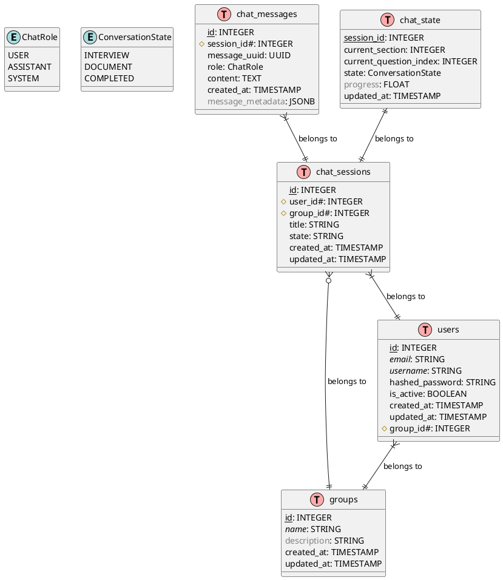

# System Architecture

## High-Level Architecture

AI4MDE follows a modern, microservices-based architecture with the following main components:

1. **Frontend Layer**
   - React-based web interface
   - Real-time collaboration features
   - Responsive design for all devices

2. **API Gateway**
   - Authentication and authorization
   - Request routing and load balancing
   - Rate limiting and caching

3. **Core Services**
   - Model Management Service
   - AI Processing Service
   - Collaboration Service
   - Version Control Service

4. **AI Components**
   - Natural Language Processing Engine
   - Model Analysis Engine
   - Code Generation Engine
   - Pattern Recognition Engine

## Technology Stack

- **Frontend**: React, TypeScript, Tailwind CSS
- **Backend**: FastAPI, Python, SQLAlchemy
- **Database**: PostgreSQL
- **AI/ML**: PyTorch, Transformers, Scikit-learn
- **Infrastructure**: Docker, Kubernetes 

## UML Diagram

