## 1. Introduction

### 1.1 Purpose

The purpose of this document is to define the software requirements for **Liber Online**, an online bookstore. This document provides a detailed description of the system's functional and non-functional requirements. It will serve as a reference for stakeholders, including developers, testers, and project managers, to ensure the successful implementation of the platform.

### 1.2 Scope

**Liber Online** is an eCommerce platform designed to sell a variety of products, including:

- **Books:** Fiction, non-fiction, academic, and more.
- **Magazines:** Monthly, weekly, and special editions across genres.
- **Smart Games:** Interactive games designed for learning and entertainment.
- **Postcards:** A curated selection of postcards for various occasions and themes.

In addition to serving the general public, **Liber Online** is the preferred supplier for **Leiden University**. The platform caters to the needs of all faculties, including but not limited to:

- **Law Studies**
- **History**
- **Computer Science**

The system will allow customers to:

- Browse and search for products.
- Create accounts to manage orders and preferences.
- Purchase items using secure payment methods.
- View personalized recommendations.
- Access order history and download digital products (if applicable).

The platform will also provide administrators with tools to manage inventory, track sales, and handle customer inquiries. The goal is to create a user-friendly, scalable, and secure platform that meets the needs of both customers and administrators.

### 1.3 Definitions, Acronyms, and Abbreviations

- **SRS:** Software Requirements Specification
- **SKU:** Stock Keeping Unit
- **UI:** User Interface
- **UX:** User Experience
- **HTTPS:** Hypertext Transfer Protocol Secure

### 1.4 References

- IEEE Std 830-1998, _Recommended Practice for Software Requirements Specifications_.
- [Insert links or documents related to the bookstore or technical references]

### 1.5 Overview

This document is organized as follows:

- **Section 1:** Introduction - Provides an overview of the project and its goals.
- **Section 2:** Overall Description - Describes the general factors influencing the system.
- **Section 3:** Specific Requirements - Details functional and non-functional requirements.
- **Section 4:** System Architecture - Describes the technology stack and deployment architecture.
- **Section 5:** UML Models - Provides visual representations of the system's requirements and workflows.

## 2. Overall Description

### 2.1 Product Perspective

**Liber Online** is a new platform specifically designed for eCommerce. It builds upon modern web development technologies and integrates seamlessly with third-party tools for payment processing, inventory management, and analytics. The system is standalone and will function independently but has provisions to integrate with Leiden University’s existing procurement systems as needed.

#### Key Features:

- **Multi-product Support:** Handles books, magazines, smart games, and postcards with efficient inventory management.
- **Academic Focus:** Tailored product offerings for Leiden University faculties, ensuring easy access to required materials.
- **Scalable Architecture:** Designed to accommodate a growing customer base and product catalog.

The webshop will deliver an intuitive experience for customers and administrators alike, leveraging responsive web design and secure transactions.

### 2.2 Product Functions

The key functions of **Liber Online** include:

- **Product Management:**

    - Add, update, or delete items in the catalogue (books, magazines, smart games, postcards).
    - Categorize and tag items for easier searchability.
- **User Account Management:**

    - Customer account creation, login, and password recovery.
    - Ability to view order history and manage preferences.
- **Search and Navigation:**

    - Advanced search functionality with filters (e.g., genre, price, author).
    - Intuitive navigation through product categories.
- **Order and Checkout:**

    - Add items to a cart and proceed to a secure checkout.
    - Multiple payment options (e.g., credit/debit cards, online banking).
- **Academic Integration:**

    - Special academic product bundles for Leiden University.
    - Faculty-specific recommendations (e.g., law, history, computer science).
- **Reporting and Analytics:**

    - View sales data, inventory levels, and customer behavior analytics.
- **Customer Support:**

    - Contact forms and chat support for addressing user queries.

### 2.3 User Characteristics

**Liber Online** will cater to the following user groups:

- **General Customers:** Individuals looking to purchase books, magazines, smart games, and postcards for personal or professional use.
- **Students and Faculty at Leiden University:** Academic users requiring specialized books and materials. These users may prefer features like pre-assembled product bundles or quick access to required readings.
- **Administrators:** Internal users responsible for managing inventory, orders, and customer inquiries.

Users will vary in technical expertise, so the system will prioritize simplicity and intuitive design.

### 2.4 Constraints

- **Legal and Compliance Requirements:** The platform must comply with GDPR for handling customer data.
- **Budgetary Constraints:** Development and deployment must remain within predefined financial limits.
- **Integration Limitations:** Any integration with Leiden University’s systems must adhere to their IT policies and standards.
- **Performance Requirements:** The platform must handle at least 1,000 concurrent users during peak times.

### 2.5 Assumptions and Dependencies

- The webshop will rely on third-party payment gateways for secure transactions.
- Hosting will be managed via a cloud-based provider to ensure scalability.
- Product data (e.g., images, descriptions) will be provided by suppliers or Leiden University as applicable.
- Future features like mobile apps or multilingual support are outside the current project scope but may be added in subsequent phases.

### 2.6 Apportioning of Requirements

Some advanced features, such as AI-based recommendations, integration with mobile apps, or extensive reporting dashboards, will be considered in future development phases. The current focus is on implementing the core eCommerce functionalities.

## 3. Specific Requirements

### 3.1 User Types

The system supports different user roles, each with specific privileges and responsibilities. These roles define the level of access and the capabilities within the platform. The following roles are defined:

- **Customer**
    Customers can either create an account or check out as guests. Registered customers can manage their personal information, order history, and track shipments. Guest customers can browse and purchase products without needing an account.

- **Admin**
    Admin users are responsible for the technical management of the website, such as configuring system settings, managing users, and monitoring overall site performance. They have full access to backend features like system logs and security settings.

- **Content Manager**
    Content managers are responsible for managing the content on the platform. They can add, remove, and modify products, including descriptions, images, and stock levels. Their responsibilities ensure that the product catalog is up-to-date and accurate.

- **Financial Manager**
    Financial managers oversee the financial aspects of the platform. They are responsible for managing discounts, promotions, and monitoring revenue. They can configure discount rules, track sales, and ensure that financial operations are smooth.


### 3.2 Functional Requirements

The following table lists the core functional requirements for the platform. These requirements define the specific capabilities that the system must deliver to fulfill its intended purpose.

|**ID**|**Name**|**Rationale**|**Description**|**Priority**|
|---|---|---|---|---|
|FR001|User Registration and Login|Enables users to create accounts and securely access the platform.|Includes account creation, login, password reset, and profile management.|Must Have|
|FR002|Product Search and Filtering|Helps users find products quickly and efficiently.|Filters by category, price, author, and faculty-specific needs for Leiden University.|Must Have|
|FR003|Shopping Cart and Checkout|Allows users to add items to a cart and complete purchases.|Includes secure payment gateway integration with support for multiple payment methods.|Must Have|
|FR004|Academic Bundles for Leiden University|Supports university-specific needs by bundling materials for faculties like law, history, etc.|Customizable bundles for faculty-specific recommendations.|Must Have|
|FR005|Inventory Management|Enables administrators to manage stock levels and product availability.|Includes alerts for low stock and the ability to update product details.|Must Have|
|FR006|Order Tracking and History|Provides customers with details of their past and current orders.|Includes estimated delivery times, order statuses, and downloadable invoices.|Should Have|
|FR007|Personalized Recommendations|Suggests products based on user preferences and past behavior.|Uses a rule-based or AI-based recommendation engine.|Should Have|
|FR008|Multi-Language Support|Expands the platform's usability for non-English speaking customers.|Provides interface translations and product descriptions in multiple languages.|Could Have|
|FR009|Reporting Dashboard|Allows administrators to view sales data, customer behavior, and other insights.|Includes visual charts and downloadable reports for easy analysis.|Should Have|

### 3.3 Non-Functional Requirements

The following table details the system's non-functional requirements, which specify performance, security, and other quality attributes.

|**ID**|**Name**|**Rationale**|**Description**|**Priority**|
|---|---|---|---|---|
|NFR001|Scalability|Ensures the platform can handle growing user and product demands.|Must support up to 10,000 concurrent users without significant performance degradation.|Must Have|
|NFR002|Security|Protects user data and ensures secure transactions.|Complies with GDPR standards and uses HTTPS for all communications.|Must Have|
|NFR003|Availability|Ensures the platform is accessible to users consistently.|Uptime of 99.9% is required to maintain customer trust and business operations.|Must Have|
|NFR004|Performance|Improves user experience by minimizing response times.|Pages should load within 2 seconds under normal conditions.|Must Have|
|NFR005|Usability|Makes the platform easy to use for all user groups.|Intuitive UI with clear navigation and minimal learning curve for new users.|Must Have|
|NFR006|Maintainability|Reduces the cost and complexity of future updates and maintenance.|Modular architecture with clear documentation for developers.|Should Have|
|NFR007|Compatibility|Ensures integration with Leiden University’s procurement systems.|Adheres to API and data exchange standards of the university.|Should Have|
|NFR008|Localization|Supports diverse customer demographics.|Allows for currency, language, and region-specific configurations.|Could Have|
|NFR009|Backup and Recovery|Prevents data loss and ensures quick recovery in case of failures.|Daily backups with a recovery point objective (RPO) of 24 hours and recovery time objective (RTO) of 4 hours.|Must Have|

### 3.4 External Interface Requirements

#### 3.4.1 User Interfaces

- A responsive, visually appealing web interface for desktop and mobile devices.
- Intuitive navigation, with clear menu options for browsing, searching, and account management.
- Accessible design adhering to WCAG standards for users with disabilities.

#### 3.4.2 Hardware Interfaces

- Compatible with standard web servers and cloud hosting providers (e.g., AWS, Azure).
- Supports desktop, tablet, and smartphone devices using modern browsers.

#### 3.4.3 Software Interfaces

- Integration with payment gateways like Stripe or PayPal.
- REST APIs for connecting with Leiden University’s procurement systems.
- Inventory management and analytics tools.

#### 3.4.4 Communication Interfaces

- HTTPS for secure communication between the client and server.
- Notifications via email or SMS for order updates and promotions.

### 3.5 System Features

Each system feature corresponds to functional requirements and includes:

- **Registration and Login:** Ensures secure access to the platform.
- **Search and Filtering:** Provides advanced options for finding products quickly.
- **Shopping Cart and Checkout:** Handles order placement with secure payments.

Additional features include academic bundles, personalized recommendations, and reporting tools.

### 3.6 Business Rules

- Customers must agree to terms and conditions before making a purchase.
- Returns are only accepted within 30 days of delivery, unless specified otherwise for academic materials.
- Leiden University-specific product bundles must be configurable by administrators.

### 3.7 Logical Database Requirements

The platform will maintain databases for:

- **Users:** Storing account information, preferences, and order history.
- **Products:** Managing titles, categories, prices, stock levels, and metadata.
- **Transactions:** Logging orders, payments, and refunds.

### 3.8 Performance Requirements

- The platform must handle up to 1,000 concurrent users at peak times with a response time of less than 2 seconds.
- Payment processing must complete within 5 seconds under normal conditions.

### 3.9 Assumptions and Dependencies

- Users will access the platform using modern browsers such as Chrome, Firefox, or Safari.
- Product descriptions and images will be supplied by publishers or Leiden University.
- Integration with third-party APIs for payments and analytics is critical to operations.

## 4. System Architecture

### 4.1 Technology Stack

The following technologies will be used to build and deploy the Online Bookstore:

- **Frontend:**

    - React.js for building the user interface (UI).
    - Redux for state management.
    - Bootstrap for responsive design and UI components.
- **Backend:**

    - Node.js with Express.js for handling API requests and server-side logic.
- **Database:**

    - PostgreSQL for relational database management, used to store product details, user accounts, orders, etc.
- **Payment Gateway:**

    - Stripe for payment processing and managing transactions.
- **Hosting/Cloud:**

    - Amazon Web Services (AWS) for hosting and deployment (EC2, S3, RDS).
- **Version Control:**

    - Git for version control, with GitHub for remote repository hosting.
- **Authentication and Authorization:**

    - JSON Web Tokens (JWT) for secure authentication and session management.
- **Additional Tools:**

    - Docker for containerization.
    - Redis for caching frequently accessed data and improving performance.

### Code Blocks

Here's a TypeScript code example:

```typescript
interface User {
  id: string;
  name: string;
}
```


```python
def hello():
    print("Hello, World!")
```

```typescript
interface User {
  id: string;
  username: string;
  group_name: string;
}

function getGroupDocuments(user: User): Promise<Document[]> {
  return fetchDocuments(user.group_name);
}
```

## 5. UML Models

### 5.1 Use Case Diagram

The use case diagram illustrates the interactions between different actors and the system. Below, the use cases are divided by actor for clarity.

#### 5.1.1 Customer Use Cases

Customers interact with the system to browse products, manage their orders, and take advantage of personalized features.


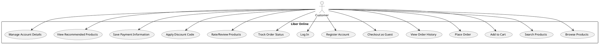

#### Description of Customer Use Cases

- **Browse Products:** Customers can browse through the available products.
- **Search Products:** Customers can search for specific products.
- **Add to Cart:** Customers can add products to their shopping cart.
- **Place Order:** After reviewing the cart, customers can place an order.
- **View Order History:** Customers can check their previous orders.
- **Checkout as Guest:** Customers can place an order without creating an account.
- **Register Account:** Customers can create an account to save their preferences.
- **Log In:** Registered customers can log into their accounts.
- **Track Order Status:** Customers can track the progress of their orders.
- **Rate/Review Products:** Customers can leave feedback on purchased products.
- **Apply Discount Code:** Customers can apply any available discount codes during checkout.
- **Save Payment Information:** Customers can securely save their payment methods for future use.
- **View Recommended Products:** Based on browsing history, customers receive product recommendations.
- **Manage Account Details:** Customers can update their personal details, such as address and email.

#### 5.1.2 Admin Use Cases

Admins manage the back-end of the system, including site settings, user management, and performance monitoring.


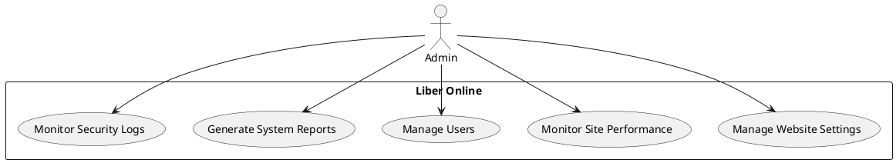

#### Description of Admin Use Cases

- **Manage Website Settings:** Admins configure the system's core settings.
- **Monitor Site Performance:** Admins monitor website traffic and user behavior.
- **Manage Users:** Admins can create, modify, and deactivate user accounts.
- **Generate System Reports:** Admins generate reports on sales, user activity, etc.
- **Monitor Security Logs:** Admins review security logs to ensure the safety of the platform.

#### 5.1.3 Content Manager Use Cases

Content managers oversee the product catalogue, managing its content and ensuring the system's product data is up-to-date.


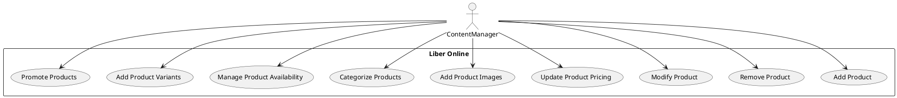

#### Description of Content Manager Use Cases

- **Add Product:** Content managers can add new products to the catalog.
- **Remove Product:** Content managers can remove products that are no longer available.
- **Modify Product:** Content managers can modify existing product information (name, description, etc.).
- **Update Product Pricing:** Content managers can update prices for products.
- **Add Product Images:** Content managers can upload or modify product images.
- **Categorize Products:** Content managers can organize products into categories for better navigation.
- **Manage Product Availability:** Content managers can mark products as in-stock or out-of-stock.
- **Add Product Variants:** Content managers can add variants of a product (e.g., different sizes or formats).
- **Promote Products:** Content managers can feature certain products for promotions or seasonal sales.

#### 5.1.4 Financial Manager Use Cases

Financial managers handle the financial aspects of the platform, including discounts, revenue tracking, and reporting.


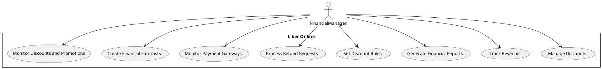

#### Description of Financial Manager Use Cases

- **Manage Discounts:** Financial managers can configure discount rules (e.g., seasonal or promotional discounts).
- **Track Revenue:** Financial managers track the system's revenue and financial performance.
- **Generate Financial Reports:** Financial managers generate reports for revenue, profits, and other financial metrics.
- **Set Discount Rules:** Financial managers define and apply rules for discount offers.
- **Process Refund Requests:** Financial managers process refunds for customer returns or issues with orders.
- **Monitor Payment Gateways:** Financial managers oversee the status of payment processing.
- **Create Financial Forecasts:** Financial managers analyze sales data and create financial forecasts.
- **Monitor Discounts and Promotions:** Financial managers track the success of ongoing discounts and promotional campaigns.

### 5.2 Activity Diagrams

#### 5.2.1 Customer Activity Diagram

The customer flow includes browsing products, adding to the cart, and completing the purchase.


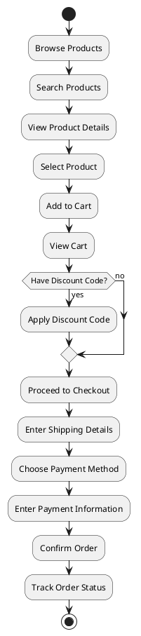

#### Description of Customer Activity Diagram

1. **Browse Products:** The customer begins by browsing available products.
2. **Search Products:** The customer can search for specific products.
3. **View Product Details:** The customer can view more detailed information about a product.
4. **Select Product:** The customer selects the product they want to purchase.
5. **Add to Cart:** The product is added to the shopping cart.
6. **View Cart:** The customer views the cart to review selected items.
7. **Apply Discount Code:** If the customer has a discount code, they can apply it during checkout.
8. **Proceed to Checkout:** The customer moves to the checkout process.
9. **Enter Shipping Details:** The customer provides shipping information.
10. **Choose Payment Method:** The customer selects the payment method.
11. **Enter Payment Information:** The customer provides payment details.
12. **Confirm Order:** The customer confirms the order and completes the checkout process.
13. **Track Order Status:** After placing the order, the customer can track the order status.

#### 5.2.2 Admin Activity Diagram

The admin flow focuses on managing the system, user roles, and monitoring security.


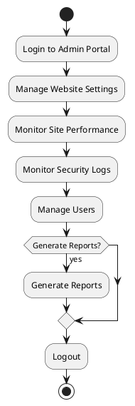

#### Description of Admin Activity Diagram

1. **Login to Admin Portal:** The admin logs into the back-end system.
2. **Manage Website Settings:** The admin configures system settings, including payment gateways and security.
3. **Monitor Site Performance:** The admin reviews traffic and performance analytics.
4. **Monitor Security Logs:** The admin checks security logs for any suspicious activities.
5. **Manage Users:** The admin manages user accounts, including assigning roles or disabling accounts.
6. **Generate Reports:** The admin can generate reports based on user activity, sales, and system performance.
7. **Logout:** After completing tasks, the admin logs out of the system.

#### 5.2.3 Content Manager Activity Diagram

The content manager manages the product catalog and updates product information.


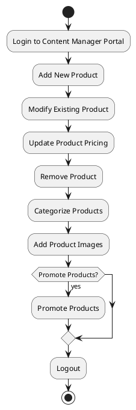

#### Description of Content Manager Activity Diagram

1. **Login to Content Manager Portal:** The content manager logs into the backend system.
2. **Add New Product:** The content manager adds new products to the catalog.
3. **Modify Existing Product:** Existing product details are updated as needed.
4. **Update Product Pricing:** The content manager updates the prices of products.
5. **Remove Product:** The content manager removes out-of-stock or discontinued products.
6. **Categorize Products:** The content manager organizes products into categories for easier navigation.
7. **Add Product Images:** The content manager adds or modifies product images to enhance visual appeal.
8. **Promote Products:** If applicable, the content manager promotes specific products for better visibility.
9. **Logout:** The content manager logs out after completing their tasks.

#### 5.2.4 Financial Manager Activity Diagram

The financial manager handles discounts, revenue tracking, and monitoring financial reports.


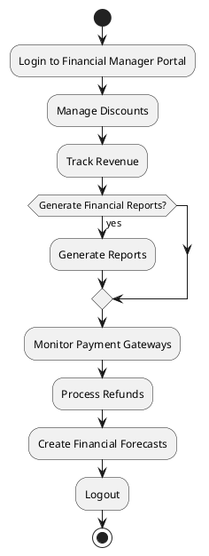

#### Description of Financial Manager Activity Diagram

1. **Login to Financial Manager Portal:** The financial manager logs into the backend portal.
2. **Manage Discounts:** The financial manager configures discount rules and promotional offers.
3. **Track Revenue:** Revenue is tracked and analyzed.
4. **Generate Financial Reports:** Financial managers can generate detailed financial reports.
5. **Monitor Payment Gateways:** The financial manager monitors the status of payment transactions.
6. **Process Refunds:** The financial manager processes customer refund requests.
7. **Create Financial Forecasts:** Future financial performance is forecasted based on data.
8. **Logout:** The financial manager logs out after completing tasks.

### 5.3 Sequence Diagrams

#### 5.3.1 Customer Sequence Diagram

The customer sequence diagram shows the flow of actions from the customer placing an order to the completion of the transaction.


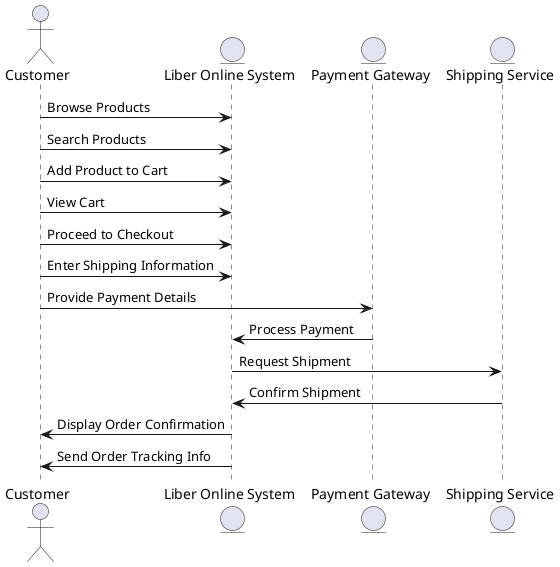

#### Description of Customer Sequence Diagram

1. **Browse Products/Search Products:** The customer browses and searches for products.
2. **Add Product to Cart:** The customer adds selected products to the shopping cart.
3. **Proceed to Checkout:** The customer proceeds to the checkout process.
4. **Enter Shipping Information:** The customer provides shipping details.
5. **Provide Payment Details:** The customer enters their payment details.
6. **Process Payment:** The payment gateway processes the payment.
7. **Request Shipment:** The system requests the shipment from the shipping service.
8. **Confirm Shipment:** The shipping service confirms the shipment.
9. **Display Order Confirmation:** The system displays the order confirmation to the customer.
10. **Send Order Tracking Info:** The system sends the tracking information to the customer.

#### 5.3.2 Admin Sequence Diagram

The admin sequence diagram illustrates how admins manage user accounts and monitor the system.


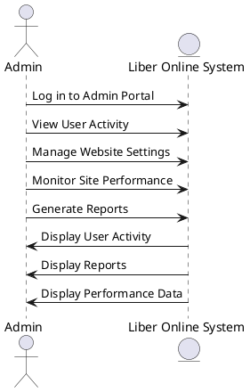

#### Description of Admin Sequence Diagram

1. **Log in to Admin Portal:** The admin logs into the system.
2. **View User Activity:** The admin reviews user activity and interactions.
3. **Manage Website Settings:** The admin modifies system configurations.
4. **Monitor Site Performance:** The admin monitors site traffic and performance metrics.
5. **Generate Reports:** The admin generates reports on various system aspects like sales or user behavior.
6. **Display User Activity/Reports/Performance Data:** The system returns relevant data and reports to the admin.

#### 5.3.3 Content Manager Sequence Diagram

The content manager sequence diagram illustrates how the content manager interacts with the system to update and manage the product catalog.


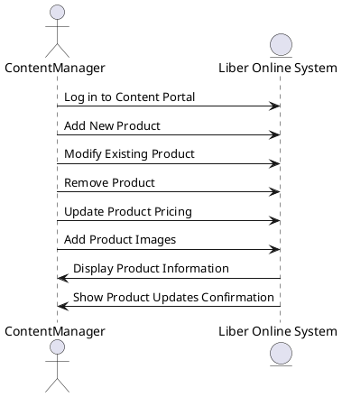

#### Description of Content Manager Sequence Diagram

1. **Log in to Content Portal:** The content manager logs into the backend system.
2. **Add New Product:** The content manager adds new products to the catalog.
3. **Modify Existing Product:** The content manager modifies existing product details.
4. **Remove Product:** The content manager removes discontinued or unavailable products.
5. **Update Product Pricing:** The content manager adjusts product prices.
6. **Add Product Images:** The content manager uploads or modifies product images.
7. **Display Product Information/Confirmation:** The system returns product information or confirms changes made.

#### 5.3.4 Financial Manager Sequence Diagram

The financial manager sequence diagram illustrates the interactions for managing discounts, tracking revenue, and processing payments.


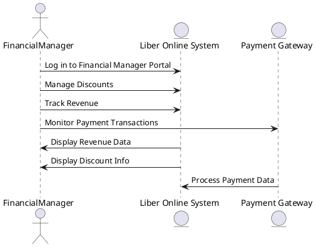

#### Description of Financial Manager Sequence Diagram

1. **Log in to Financial Manager Portal:** The financial manager logs into the backend system.
2. **Manage Discounts:** The financial manager configures discount codes and offers.
3. **Track Revenue:** The financial manager reviews revenue and sales data.
4. **Monitor Payment Transactions:** The financial manager monitors payment transactions and verifies payments.
5. **Display Revenue Data/Discount Info:** The system provides relevant financial data to the manager.
6. **Process Payment Data:** The payment gateway processes transactions and returns the status.

### 5.4 Class Diagram

The class diagram shows the key entities in the system, their attributes, and how they relate to each other. The addition of the `Account` class for each user role helps manage user authentication and access.


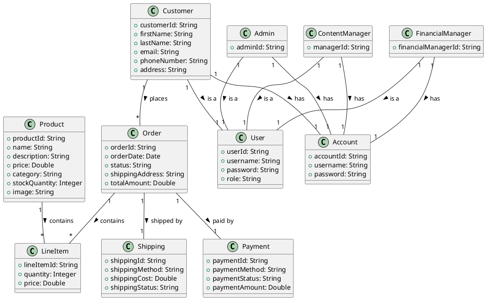

#### Description of the Updated Class Diagram with the User Class

- **User:** The `User` class is a base class for all types of users (Customer, Admin, ContentManager, FinancialManager). It contains common attributes like `userId`, `username`, `password`, and `role`, which are used for authentication and authorization within the system.
- **Customer, Admin, ContentManager, FinancialManager:** These classes now inherit from the `User` class, which means they inherit the login-related attributes (`username`, `password`, `role`) and can have their own specific attributes like `customerId`, `adminId`, and so on.
- **Product:** Represents individual items for sale in the store (e.g., books, magazines), with attributes like name, price, and stock.
- **Order:** Represents a customer order, which contains multiple `LineItems` and is linked to `Payment` and `Shipping` records.
- **LineItem:** Represents an individual product in an order, containing attributes for quantity and price.
- **Payment:** Represents the payment details for an order, including payment method, status, and amount.
- **Shipping:** Represents the shipping details for an order, including shipping method and status.
- **Account:** Manages login credentials for users (Customer, Admin, ContentManager, FinancialManager).

#### Relationships:

- **User** is the parent class of **Customer**, **Admin**, **ContentManager**, and **FinancialManager**.
- Each user type (Customer, Admin, ContentManager, FinancialManager) has an associated **Account** class for login and authentication.
- A **Customer** can place multiple **Orders**, which contain multiple **LineItems**.
- The **Order** is linked to both **Payment** and **Shipping**.
- A **Product** can be part of many **LineItems** (across different orders).

### 5.5 Component Diagram

The component diagram illustrates the main software components of the Online Bookstore and their relationships.


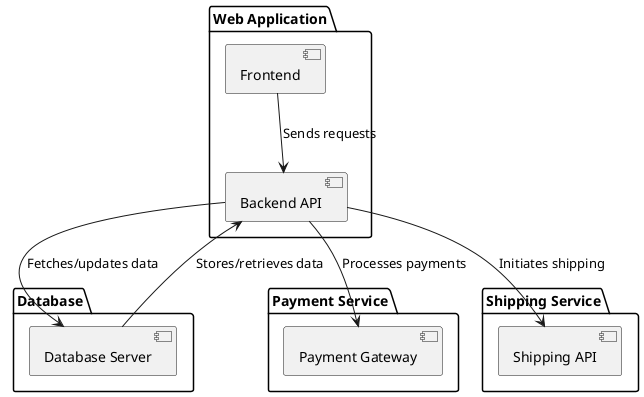

#### Explanation:

- **Frontend** communicates with the **Backend API** to send requests (like browsing products, adding to cart).
- The **Backend API** interacts with the **Database Server** to retrieve or store product details, customer orders, etc.
- The **Backend API** also communicates with **Payment Gateway** for processing payments and with **Shipping API** to manage shipping services.
- The **Database Server** stores all relevant data, including user accounts, orders, products, etc.

### 5.6 State Diagram

This state diagram represents the lifecycle of an **Order** in the Online Bookstore system.


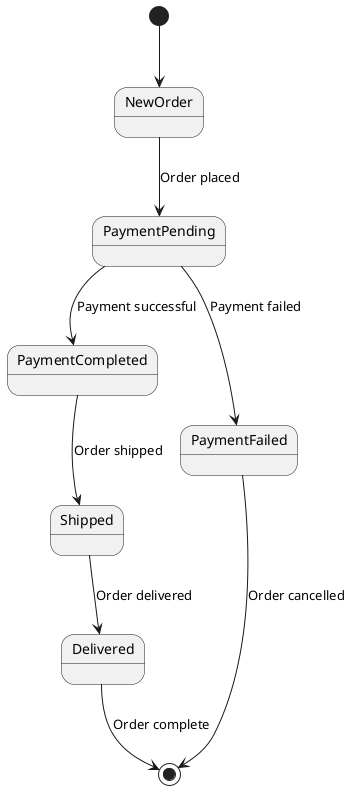

#### Explanation:

- The **Order** starts in the `NewOrder` state.
- It transitions to `PaymentPending` when the customer places an order.
- If the payment is successful, the order moves to the `PaymentCompleted` state and then to `Shipped`, eventually reaching `Delivered` once the customer receives the order.
- If the payment fails, the order is marked as `PaymentFailed` and is canceled.

### 5.7 Data Flow Diagram (DFD)

The Data Flow Diagram (Level 0) shows the flow of data in the Online Bookstore system.


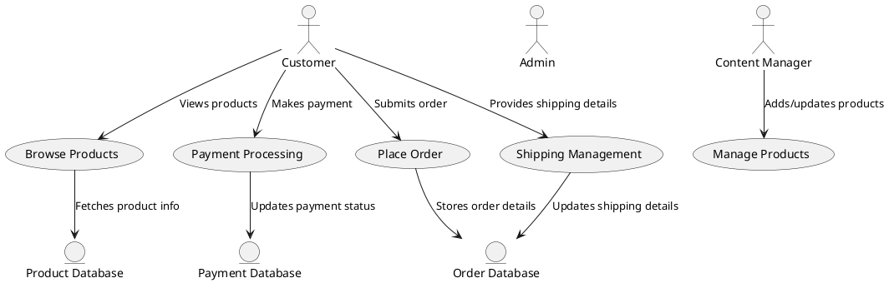

#### Explanation:

- **Customer** can browse products, place orders, make payments, and provide shipping details.
- **Content Manager** is the actor responsible for managing the product catalog (add, update, remove products).
- The **Admin** remains in the diagram but is not involved in managing products. Instead, the Admin would likely be managing system settings, users, or other technical aspects.
- **Product Database**, **Order Database**, and **Payment Database** are entities that represent where data is stored, and processes interact with these data stores.

### 5.8 Deployment Diagram

This deployment diagram illustrates the physical architecture of the Online Bookstore, showing the deployment of various components.


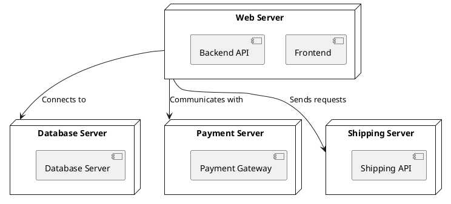

#### Explanation:

- The **Web Server** hosts the **Frontend** and **Backend API** components.
- The **Database Server** stores all the application data (products, orders, user accounts, etc.).
- The **Payment Server** handles payment transactions, typically through a third-party service (e.g., Stripe).
- The **Shipping Server** manages shipping processes and interacts with external delivery services.
ai4mde-acc:~/ai4mde/chatfront/content$
ai4mde-acc:~/ai4mde/chatfront/content$
ai4mde-acc:~/ai4mde/chatfront/content$
ai4mde-acc:~/ai4mde/chatfront/content$
ai4mde-acc:~/ai4mde/chatfront/content$
ai4mde-acc:~/ai4mde/chatfront/content$
ai4mde-acc:~/ai4mde/chatfront/content$
ai4mde-acc:~/ai4mde/chatfront/content$ ll
total 108K
-rw-r--r--    1 admimo   admimo     51.9K Dec  2 08:14 liacs-book-store.md
-rw-r--r--    1 admimo   admimo     39.2K Dec  2 08:14 liber-book-store.md
-rw-r--r--    1 admimo   admimo     12.3K Dec  2 08:14 srs-template.md
ai4mde-acc:~/ai4mde/chatfront/content$ cat liacs-book-store.md
---
id: liacs-book-store
title: Liacs book store - A online book store for all LIACS students
description: Semi automated document for the Liacs book store.
date: 1970-01-01

---

# 1. Introduction
## 1.1 Purpose
The purpose of this document is to define the software requirements for **Liber Online**, an online bookstore. This document provides a detailed description of the system's functional and non-functional requirements. It will serve as a reference for stakeholders, including developers, testers, and project managers, to ensure the successful implementation of the webshop.

## 1.2 Scope

**Liber Online** is an eCommerce platform designed to sell a variety of products, including:
- **Books:** Fiction, non-fiction, academic, and more.
- **Magazines:** Monthly, weekly, and special editions across genres.
- **Smart Games:** Interactive games designed for learning and entertainment.
- **Postcards:** A curated selection of postcards for various occasions and themes.

In addition to serving the general public, **Liber Online** is the preferred supplier for **Leiden University**. The platform caters to the needs of all faculties, including but not limited to:
- **Law Studies**
- **History**
- **Computer Science**

The system will allow customers to:
- Browse and search for products.
- Create accounts to manage orders and preferences.
- Purchase items using secure payment methods.
- View personalized recommendations.
- Access order history and download digital products (if applicable).

The platform will also provide administrators with tools to manage inventory, track sales, and handle customer inquiries. The goal is to create a user-friendly, scalable, and secure platform that meets the needs of both customers and administrators.

## 1.3 Definitions, Acronyms, and Abbreviations

- **SRS:** Software Requirements Specification
- **SKU:** Stock Keeping Unit
- **UI:** User Interface
- **UX:** User Experience
- **HTTPS:** Hypertext Transfer Protocol Secure

## 1.4 References
- IEEE Std 830-1998, *Recommended Practice for Software Requirements Specifications*.
- [Insert links or documents related to the bookstore or technical references]

## 1.5 Overview
This document is organized as follows:
- **Section 1:** Introduction - Provides an overview of the project and its goals.
- **Section 2:** Overall Description - Describes the general factors influencing the system.
- **Section 3:** Specific Requirements - Details functional and non-functional requirements.
- **Section 4:** Supporting Information - Includes appendices and references.


# 2. Overall Description

## 2.1 Product Perspective

**Liber Online** is a new platform specifically designed for eCommerce. It builds upon modern web development technologies and integrates seamlessly with third-party tools for payment processing, inventory management, and analytics. The system is standalone and will function independently but has provisions to integrate with Leiden University’s existing procurement systems as needed.

### Key Features:
- **Multi-product Support:** Handles books, magazines, smart games, and postcards with efficient inventory management.
- **Academic Focus:** Tailored product offerings for Leiden University faculties, ensuring easy access to required materials.
- **Scalable Architecture:** Designed to accommodate a growing customer base and product catalog.

The webshop will deliver an intuitive experience for customers and administrators alike, leveraging responsive web design and secure transactions.

## 2.2 Product Functions
The key functions of **Liber Online** include:
- **Product Management:**
- Add, update, or delete items in the catalogue (books, magazines, smart games, postcards).
- Categorise and tag items for easier searchability.

- **User Account Management:**
- Customer account creation, login, and password recovery.
- Ability to view order history and manage preferences.

- **Search and Navigation:**
- Advanced search functionality with filters (e.g., genre, price, author).
- Intuitive navigation through product categories.

- **Order and Checkout:**
- Add items to a cart and proceed to a secure checkout.
- Multiple payment options (e.g., credit/debit cards, online banking).

- **Academic Integration:**
- Special academic product bundles for Leiden University.
- Faculty-specific recommendations (e.g., law, history, computer science).

- **Reporting and Analytics:**
- View sales data, inventory levels, and customer behaviour analytics.

- **Customer Support:**
- Contact forms and chat support for addressing user queries.


## 2.3 User Characteristics

**Liber Online** will cater to the following user groups:

- **General Customers:**
Individuals looking to purchase books, magazines, smart games, and postcards for personal or professional use.

- **Students and Faculty at Leiden University:**
Academic users requiring specialized books and materials. These users may prefer features like pre-assembled product bundles or quick access to required readings.

- **Administrators:**
Internal users responsible for managing inventory, orders, and customer inquiries.


Users will vary in technical expertise, so the system will prioritize simplicity and intuitive design.

## 2.4 Constraints

- **Legal and Compliance Requirements:** The platform must comply with GDPR for handling customer data.
- **Budgetary Constraints:** Development and deployment must remain within predefined financial limits.
- **Integration Limitations:** Any integration with Leiden University’s systems must adhere to their IT policies and standards.
- **Performance Requirements:** The platform must handle at least 1,000 concurrent users during peak times.

## 2.5 Assumptions and Dependencies

- The webshop will rely on third-party payment gateways for secure transactions.
- Hosting will be managed via a cloud-based provider to ensure scalability.
- Product data (e.g., images, descriptions) will be provided by suppliers or Leiden University as applicable.
- Future features like mobile apps or multilingual support are outside the current project scope but may be added in subsequent phases.


## 2.6 Apportioning of Requirements
Some advanced features, such as AI-based recommendations, integration with mobile apps, or extensive reporting dashboards, will be considered in future development phases. The current focus is on implementing the core eCommerce functionalities.

# 3. Specific Requirements
This section provides a detailed description of the functional and non-functional requirements for **Liber Online**. It outlines the capabilities the system must provide to meet user and business needs. Additionally, this section defines how the system will interact with external components, its expected performance, and key business rules governing its operation.

## 3.1 User Types
The system supports different user roles, each with specific privileges and responsibilities. These roles define the level of access and the capabilities within the platform. The following roles are defined:
- **Customer**
    Customers can either create an account or check out as guests. Registered customers can manage their personal information, order history, and track shipments. Guest customers can browse and purchase products without needing an account.

- **Admin**
    Admin users are responsible for the technical management of the website, such as configuring system settings, managing users, and monitoring overall site performance. They have full access to backend features like system logs and security settings.

- **Content Manager**
    Content managers are responsible for managing the content on the platform. They can add, remove, and modify products, including descriptions, images, and stock levels. Their responsibilities ensure that the product catalog is up-to-date and accurate.

- **Financial Manager**
    Financial managers oversee the financial aspects of the platform. They are responsible for managing discounts, promotions, and monitoring revenue. They can configure discount rules, track sales, and ensure that financial operations are smooth.
## 3.1 Functional Requirements
The following table lists the core functional requirements for the platform. These requirements define the specific capabilities that the system must deliver to fulfill its intended purpose.

| **ID** | **Name**                               | **Rationale**                                                                                  | **Description**                                                                        | **Priority** |
| ------ | -------------------------------------- | ---------------------------------------------------------------------------------------------- | -------------------------------------------------------------------------------------- | ------------ |
| FR001  | User Registration and Login            | Enables users to create accounts and securely access the platform.                             | Includes account creation, login, password reset, and profile management.              | Must Have    |
| FR002  | Product Search and Filtering           | Helps users find products quickly and efficiently.                                             | Filters by category, price, author, and faculty-specific needs for Leiden University.  | Must Have    |
| FR003  | Shopping Cart and Checkout             | Allows users to add items to a cart and complete purchases.                                    | Includes secure payment gateway integration with support for multiple payment methods. | Must Have    |
| FR004  | Academic Bundles for Leiden University | Supports university-specific needs by bundling materials for faculties like law, history, etc. | Customizable bundles for faculty-specific recommendations.                             | Must Have    |
| FR005  | Inventory Management                   | Enables administrators to manage stock levels and product availability.                        | Includes alerts for low stock and the ability to update product details.               | Must Have    |
| FR006  | Order Tracking and History             | Provides customers with details of their past and current orders.                              | Includes estimated delivery times, order statuses, and downloadable invoices.          | Should Have  |
| FR007  | Personalized Recommendations           | Suggests products based on user preferences and past behavior.                                 | Uses a rule-based or AI-based recommendation engine.                                   | Should Have  |
| FR008  | Multi-Language Support                 | Expands the platform's usability for non-English speaking customers.                           | Provides interface translations and product descriptions in multiple languages.        | Could Have   |
| FR009  | Reporting Dashboard                    | Allows administrators to view sales data, customer behavior, and other insights.               | Includes visual charts and downloadable reports for easy analysis.                     | Should Have  |


## 3.2 Non-Functional Requirements
The following table details the system's non-functional requirements, which specify performance, security, and other quality attributes.

| **ID** | **Name**            | **Rationale**                                                      | **Description**                                                                                               | **Priority** |
| ------ | ------------------- | ------------------------------------------------------------------ | ------------------------------------------------------------------------------------------------------------- | ------------ |
| NFR001 | Scalability         | Ensures the platform can handle growing user and product demands.  | Must support up to 10,000 concurrent users without significant performance degradation.                       | Must Have    |
| NFR002 | Security            | Protects user data and ensures secure transactions.                | Complies with GDPR standards and uses HTTPS for all communications.                                           | Must Have    |
| NFR003 | Availability        | Ensures the platform is accessible to users consistently.          | Uptime of 99.9% is required to maintain customer trust and business operations.                               | Must Have    |
| NFR004 | Performance         | Improves user experience by minimizing response times.             | Pages should load within 2 seconds under normal conditions.                                                   | Must Have    |
| NFR005 | Usability           | Makes the platform easy to use for all user groups.                | Intuitive UI with clear navigation and minimal learning curve for new users.                                  | Must Have    |
| NFR006 | Maintainability     | Reduces the cost and complexity of future updates and maintenance. | Modular architecture with clear documentation for developers.                                                 | Should Have  |
| NFR007 | Compatibility       | Ensures integration with Leiden University’s procurement systems.  | Adheres to API and data exchange standards of the university.                                                 | Should Have  |
| NFR008 | Localization        | Supports diverse customer demographics.                            | Allows for currency, language, and region-specific configurations.                                            | Could Have   |
| NFR009 | Backup and Recovery | Prevents data loss and ensures quick recovery in case of failures. | Daily backups with a recovery point objective (RPO) of 24 hours and recovery time objective (RTO) of 4 hours. | Must Have    |

## 3.3 External Interface Requirements

### 3.3.1 User Interfaces
- A responsive, visually appealing web interface for desktop and mobile devices.
- Intuitive navigation, with clear menu options for browsing, searching, and account management.
- Accessible design adhering to WCAG standards for users with disabilities.

### 3.3.2 Hardware Interfaces
- Compatible with standard web servers and cloud hosting providers (e.g., AWS, Azure).
- Supports desktop, tablet, and smartphone devices using modern browsers.

### 3.3.3 Software Interfaces
- Integration with payment gateways like Stripe or PayPal.
- REST APIs for connecting with Leiden University’s procurement systems.
- Inventory management and analytics tools.

### 3.3.4 Communication Interfaces
- HTTPS for secure communication between the client and server.
- Notifications via email or SMS for order updates and promotions.

## 3.4 System Features
Each system feature corresponds to functional requirements and includes:
- **Registration and Login:** Ensures secure access to the platform.
- **Search and Filtering:** Provides advanced options for finding products quickly.
- **Shopping Cart and Checkout:** Handles order placement with secure payments.


Additional features include academic bundles, personalized recommendations, and reporting tools.

## 3.5 Business Rules
- Customers must agree to terms and conditions before making a purchase.
- Returns are only accepted within 30 days of delivery, unless specified otherwise for academic materials.
- Leiden University-specific product bundles must be configurable by administrators.

## 3.6 Logical Database Requirements
The platform will maintain databases for:
- **Users:** Storing account information, preferences, and order history.
- **Products:** Managing titles, categories, prices, stock levels, and metadata.
- **Transactions:** Logging orders, payments, and refunds.

## 3.7 Performance Requirements
- The platform must handle up to 1,000 concurrent users at peak times with a response time of less than 2 seconds.
- Payment processing must complete within 5 seconds under normal conditions.

## 3.8 Assumptions and Dependencies

- Users will access the platform using modern browsers such as Chrome, Firefox, or Safari.
- Product descriptions and images will be supplied by publishers or Leiden University.
- Integration with third-party APIs for payments and analytics is critical to operations.

# 5. UML Models

This section provides a visual representation of the system's requirements and workflows using UML diagrams. These models illustrate the system's structure, use cases, interactions, and behavior.


---
## 5.1 Use Case Diagram

The use case diagram illustrates the interactions between different actors and the system. Below, the use cases are divided by actor for clarity.

---

### 5.1.1 Customer Use Cases

Customers interact with the system to browse products, manage their orders, and take advantage of personalized features.


### **Description of Customer Use Cases**
- **Browse Products:** Customers can browse through the available products.
- **Search Products:** Customers can search for specific products.
- **Add to Cart:** Customers can add products to their shopping cart.
- **Place Order:** After reviewing the cart, customers can place an order.
- **View Order History:** Customers can check their previous orders.
- **Checkout as Guest:** Customers can place an order without creating an account.
- **Register Account:** Customers can create an account to save their preferences.
- **Log In:** Registered customers can log into their accounts.
- **Track Order Status:** Customers can track the progress of their orders.
- **Rate/Review Products:** Customers can leave feedback on purchased products.
- **Apply Discount Code:** Customers can apply any available discount codes during checkout.
- **Save Payment Information:** Customers can securely save their payment methods for future use.
- **View Recommended Products:** Based on browsing history, customers receive product recommendations.
- **Manage Account Details:** Customers can update their personal details, such as address and email.


### 5.1.2 Admin Use Cases

Admins manage the back-end of the system, including site settings, user management, and performance monitoring.


### **Description of Admin Use Cases**
- **Manage Website Settings:** Admins configure the system's core settings.
- **Monitor Site Performance:** Admins monitor website traffic and user behavior.
- **Manage Users:** Admins can create, modify, and deactivate user accounts.
- **Generate System Reports:** Admins generate reports on sales, user activity, etc.
- **Monitor Security Logs:** Admins review security logs to ensure the safety of the platform.

### 5.1.3 Content Manager Use Cases

Content managers oversee the product catalogue, managing its content and ensuring the system's product data is up-to-date.
	```


### **Description of Content Manager Use Cases**
- **Add Product:** Content managers can add new products to the catalog.
- **Remove Product:** Content managers can remove products that are no longer available.
- **Modify Product:** Content managers can modify existing product information (name, description, etc.).
- **Update Product Pricing:** Content managers can update prices for products.
- **Add Product Images:** Content managers can upload or modify product images.
- **Categorize Products:** Content managers can organize products into categories for better navigation.
- **Manage Product Availability:** Content managers can mark products as in-stock or out-of-stock.
- **Add Product Variants:** Content managers can add variants of a product (e.g., different sizes or formats).
- **Promote Products:** Content managers can feature certain products for promotions or seasonal sales.

### 5.1.4 Financial Manager Use Cases

Financial managers handle the financial aspects of the platform, including discounts, revenue tracking, and reporting.

```plantuml

@startuml
actor FinancialManager

rectangle "Liber Online" {
  FinancialManager --> (Manage Discounts)
  FinancialManager --> (Track Revenue)
  FinancialManager --> (Generate Financial Reports)
  FinancialManager --> (Set Discount Rules)
  FinancialManager --> (Process Refund Requests)
  FinancialManager --> (Monitor Payment Gateways)
  FinancialManager --> (Create Financial Forecasts)
  FinancialManager --> (Monitor Discounts and Promotions)
}
@enduml
```

### **Description of Financial Manager Use Cases**
- **Manage Discounts:** Financial managers can configure discount rules (e.g., seasonal or promotional discounts).
- **Track Revenue:** Financial managers track the system's revenue and financial performance.
- **Generate Financial Reports:** Financial managers generate reports for revenue, profits, and other financial metrics.
- **Set Discount Rules:** Financial managers define and apply rules for discount offers.
- **Process Refund Requests:** Financial managers process refunds for customer returns or issues with orders.
- **Monitor Payment Gateways:** Financial managers oversee the status of payment processing.
- **Create Financial Forecasts:** Financial managers analyse sales data and create financial forecasts.
- **Monitor Discounts and Promotions:** Financial managers track the success of ongoing discounts and promotional campaigns.


## 5.2 Class Diagram
The updated Class Diagram includes the **User** class and its various types, with specific roles and responsibilities within the system.

```plantuml
@startuml
class User {
  + userId : int
  + name : String
  + email : String
  + password : String
  + role : String
  + login() : void
  + logout() : void
}

class Customer {
  + accountId : int
  + createAccount() : void
  + checkoutAsGuest() : void
  + viewOrderHistory() : void
}

class Admin {
  + adminId : int
  + configureSettings() : void
  + monitorSitePerformance() : void
  + manageUsers() : void
}

class ContentManager {
  + contentManagerId : int
  + addProduct() : void
  + removeProduct() : void
  + modifyProduct() : void
}

class FinancialManager {
  + financialManagerId : int
  + manageDiscounts() : void
  + trackRevenue() : void
  + generateFinancialReports() : void
}

class Product {
  + productId : int
  + name : String
  + description : String
  + price : double
  + stock : int
  + updateStock(quantity : int) : void
}

class Order {
  + orderId : int
  + userId : int
  + orderDate : Date
  + status : String
  + totalAmount : double
  + calculateTotal() : double
  + updateStatus(newStatus : String) : void
}

class Cart {
  + cartId : int
  + userId : int
  + addItem(productId : int, quantity : int) : void
  + removeItem(productId : int) : void
  + calculateSubtotal() : double
}

class PaymentService {
  + processPayment(orderId : int, paymentDetails : PaymentDetails) : boolean
}

class DeliveryService {
  + scheduleDelivery(orderId : int, address : String) : boolean
  + trackDelivery(orderId : int) : String
}

User <|-- Customer
User <|-- Admin
User <|-- ContentManager
User <|-- FinancialManager

Customer "1" -- "0..*" Order
Customer "1" -- "1" Cart
Cart "1" -- "0..*" Product
Order "1" -- "0..*" Product
Order "1" --> "1" PaymentService
Order "1" --> "1" DeliveryService
Order --> PaymentService : "uses"
@enduml

```


## 5.2 Activity Diagram

The activity diagram represents the flow of activities in the system for each actor. Below, the activities are divided by actor, illustrating the flow of actions they would perform in different scenarios.

---

### 5.2.1 Customer Activity Diagram

The customer flow includes browsing products, adding to the cart, and completing the purchase.

```plantuml
@startuml
start
:Browse Products;
:Search Products;
:View Product Details;
:Select Product;
:Add to Cart;
:View Cart;
if (Have Discount Code?) then (yes)
  :Apply Discount Code;
else (no)
endif
:Proceed to Checkout;
:Enter Shipping Details;
:Choose Payment Method;
:Enter Payment Information;
:Confirm Order;
:Track Order Status;
stop
@enduml
```

### **Description of Customer Activity Diagram**
1. **Browse Products:** The customer begins by browsing available products.
2. **Search Products:** The customer can search for specific products.
3. **View Product Details:** The customer can view more detailed information about a product.
4. **Select Product:** The customer selects the product they want to purchase.
5. **Add to Cart:** The product is added to the shopping cart.
6. **View Cart:** The customer views the cart to review selected items.
7. **Apply Discount Code:** If the customer has a discount code, they can apply it during checkout.
8. **Proceed to Checkout:** The customer moves to the checkout process.
9. **Enter Shipping Details:** The customer provides shipping information.
10. **Choose Payment Method:** The customer selects the payment method.
11. **Enter Payment Information:** The customer provides payment details.
12. **Confirm Order:** The customer confirms the order and completes the checkout process.
13. **Track Order Status:** After placing the order, the customer can track the order status.

### 5.2.2 Admin Activity Diagram

The admin flow focuses on managing the system, user roles, and monitoring security.

```plantuml

@startuml
start
:Login to Admin Portal;
:Manage Website Settings;
:Monitor Site Performance;
:Monitor Security Logs;
:Manage Users;
if (Generate Reports?) then (yes)
  :Generate Reports;
endif
:Logout;
stop
@enduml
```

### **Description of Admin Activity Diagram**
1. **Login to Admin Portal:** The admin logs into the back-end system.
2. **Manage Website Settings:** The admin configures system settings, including payment gateways and security.
3. **Monitor Site Performance:** The admin reviews traffic and performance analytics.
4. **Monitor Security Logs:** The admin checks security logs for any suspicious activities.
5. **Manage Users:** The admin manages user accounts, including assigning roles or disabling accounts.
6. **Generate Reports:** The admin can generate reports based on user activity, sales, and system performance.
7. **Logout:** After completing tasks, the admin logs out of the system.

### 5.2.3 Content Manager Activity Diagram

The content manager manages the product catalog and updates product information.

```plantuml

@startuml
start
:Login to Content Manager Portal;
:Add New Product;
:Modify Existing Product;
:Update Product Pricing;
:Remove Product;
:Categorize Products;
:Add Product Images;
if (Promote Products?) then (yes)
  :Promote Products;
endif
:Logout;
stop
@enduml
```

### **Description of Content Manager Activity Diagram**
1. **Login to Content Manager Portal:** The content manager logs into the backend system.
2. **Add New Product:** The content manager adds new products to the catalog.
3. **Modify Existing Product:** Existing product details are updated as needed.
4. **Update Product Pricing:** The content manager updates the prices of products.
5. **Remove Product:** The content manager removes out-of-stock or discontinued products.
6. **Categorize Products:** The content manager organizes products into categories for easier navigation.
7. **Add Product Images:** The content manager adds or modifies product images to enhance visual appeal.
8. **Promote Products:** If applicable, the content manager promotes specific products for better visibility.
9. **Logout:** The content manager logs out after completing their tasks.

### 5.2.4 Financial Manager Activity Diagram

The financial manager handles discounts, revenue tracking, and monitoring financial reports.

```plantuml

@startuml
start
:Login to Financial Manager Portal;
:Manage Discounts;
:Track Revenue;
if (Generate Financial Reports?) then (yes)
  :Generate Reports;
endif
:Monitor Payment Gateways;
:Process Refunds;
:Create Financial Forecasts;
:Logout;
stop
@enduml
```

### **Description of Financial Manager Activity Diagram**
1. **Login to Financial Manager Portal:** The financial manager logs into the backend portal.
2. **Manage Discounts:** The financial manager configures discount rules and promotional offers.
3. **Track Revenue:** Revenue is tracked and analyzed.
4. **Generate Financial Reports:** Financial managers can generate detailed financial reports.
5. **Monitor Payment Gateways:** The financial manager monitors the status of payment transactions.
6. **Process Refunds:** The financial manager processes customer refund requests.
7. **Create Financial Forecasts:** Future financial performance is forecasted based on data.
8. **Logout:** The financial manager logs out after completing tasks.


## 5.3 Sequence Diagram

The sequence diagram illustrates how objects interact in a sequence to achieve specific tasks. Below, the sequence diagrams are divided by actor to show the flow of interactions for various scenarios.

---

### 5.3.1 Customer Sequence Diagram

The customer sequence diagram shows the flow of actions from the customer placing an order to the completion of the transaction.

```plantuml
@startuml
actor Customer
entity "Liber Online System" as System
entity "Payment Gateway" as Payment
entity "Shipping Service" as Shipping

Customer -> System: Browse Products
Customer -> System: Search Products
Customer -> System: Add Product to Cart
Customer -> System: View Cart
Customer -> System: Proceed to Checkout
Customer -> System: Enter Shipping Information
Customer -> Payment: Provide Payment Details
Payment -> System: Process Payment
System -> Shipping: Request Shipment
Shipping -> System: Confirm Shipment
System -> Customer: Display Order Confirmation
System -> Customer: Send Order Tracking Info
@enduml
```

### **Description of Customer Sequence Diagram**
1. **Browse Products/Search Products:** The customer browses and searches for products.
2. **Add Product to Cart:** The customer adds selected products to the shopping cart.
3. **Proceed to Checkout:** The customer proceeds to the checkout process.
4. **Enter Shipping Information:** The customer provides shipping details.
5. **Provide Payment Details:** The customer enters their payment details.
6. **Process Payment:** The payment gateway processes the payment.
7. **Request Shipment:** The system requests the shipment from the shipping service.
8. **Confirm Shipment:** The shipping service confirms the shipment.
9. **Display Order Confirmation:** The system displays the order confirmation to the customer.
10. **Send Order Tracking Info:** The system sends the tracking information to the customer.

### 5.3.2 Admin Sequence Diagram

The admin sequence diagram illustrates how admins manage user accounts and monitor the system.

```plantuml

@startuml
actor Admin
entity "Liber Online System" as System

Admin -> System: Log in to Admin Portal
Admin -> System: View User Activity
Admin -> System: Manage Website Settings
Admin -> System: Monitor Site Performance
Admin -> System: Generate Reports
System -> Admin: Display User Activity
System -> Admin: Display Reports
System -> Admin: Display Performance Data
@enduml
```

### **Description of Admin Sequence Diagram**
1. **Log in to Admin Portal:** The admin logs into the system.
2. **View User Activity:** The admin reviews user activity and interactions.
3. **Manage Website Settings:** The admin modifies system configurations.
4. **Monitor Site Performance:** The admin monitors site traffic and performance metrics.
5. **Generate Reports:** The admin generates reports on various system aspects like sales or user behavior.
6. **Display User Activity/Reports/Performance Data:** The system returns relevant data and reports to the admin.

### 5.3.3 Content Manager Sequence Diagram

The content manager sequence diagram illustrates how the content manager interacts with the system to update and manage the product catalog.

```plantuml

@startuml
actor ContentManager
entity "Liber Online System" as System

ContentManager -> System: Log in to Content Portal
ContentManager -> System: Add New Product
ContentManager -> System: Modify Existing Product
ContentManager -> System: Remove Product
ContentManager -> System: Update Product Pricing
ContentManager -> System: Add Product Images
System -> ContentManager: Display Product Information
System -> ContentManager: Show Product Updates Confirmation
@enduml
```

### **Description of Content Manager Sequence Diagram**
1. **Log in to Content Portal:** The content manager logs into the backend system.
2. **Add New Product:** The content manager adds new products to the catalog.
3. **Modify Existing Product:** The content manager modifies existing product details.
4. **Remove Product:** The content manager removes discontinued or unavailable products.
5. **Update Product Pricing:** The content manager adjusts product prices.
6. **Add Product Images:** The content manager uploads or modifies product images.
7. **Display Product Information/Confirmation:** The system returns product information or confirms changes made.

### 5.3.4 Financial Manager Sequence Diagram

The financial manager sequence diagram illustrates the interactions for managing discounts, tracking revenue, and processing payments.

```plantuml

@startuml
actor FinancialManager
entity "Liber Online System" as System
entity "Payment Gateway" as Payment

FinancialManager -> System: Log in to Financial Manager Portal
FinancialManager -> System: Manage Discounts
FinancialManager -> System: Track Revenue
FinancialManager -> Payment: Monitor Payment Transactions
System -> FinancialManager: Display Revenue Data
System -> FinancialManager: Display Discount Info
Payment -> System: Process Payment Data
@enduml
```

### **Description of Financial Manager Sequence Diagram**
1. **Log in to Financial Manager Portal:** The financial manager logs into the backend system.
2. **Manage Discounts:** The financial manager configures discount codes and offers.
3. **Track Revenue:** The financial manager reviews revenue and sales data.
4. **Monitor Payment Transactions:** The financial manager monitors payment transactions and verifies payments.
5. **Display Revenue Data/Discount Info:** The system provides relevant financial data to the manager.
6. **Process Payment Data:** The payment gateway processes transactions and returns the status.

## 5.4 Class Diagram

The class diagram shows the key entities in the system, their attributes, and how they relate to each other. With the addition of **LineItems**, each order now contains detailed information about individual items in the cart.

```plantuml
@startuml
class Product {
  +productId: String
  +name: String
  +description: String
  +price: Double
  +category: String
  +stockQuantity: Integer
  +image: String
}

class Customer {
  +customerId: String
  +firstName: String
  +lastName: String
  +email: String
  +password: String
  +address: String
  +phoneNumber: String
}

class Order {
  +orderId: String
  +orderDate: Date
  +status: String
  +shippingAddress: String
  +totalAmount: Double
}

class LineItem {
  +lineItemId: String
  +quantity: Integer
  +price: Double
}

class Payment {
  +paymentId: String
  +paymentMethod: String
  +paymentStatus: String
  +paymentAmount: Double
}

class Shipping {
  +shippingId: String
  +shippingMethod: String
  +shippingCost: Double
  +shippingStatus: String
}

class Admin {
  +adminId: String
  +username: String
  +password: String
}

class ContentManager {
  +managerId: String
  +username: String
  +password: String
}

class FinancialManager {
  +financialManagerId: String
  +username: String
  +password: String
}

Product "1" -- "*" LineItem : contains >
Order "1" -- "*" LineItem : contains >
Order "1" -- "1" Payment : paid by >
Order "1" -- "1" Shipping : shipped by >
Customer "1" -- "*" Order : places >
Admin "1" -- "*" Product : manages >
ContentManager "1" -- "*" Product : manages >
FinancialManager "1" -- "*" Payment : processes >
@enduml
```

### **Description of the Updated Class Diagram**
- **Product:** Represents the individual items in the catalog, such as books, magazines, and smart games. It has attributes like name, description, price, and stock quantity.
- **Customer:** Represents a registered customer who can place orders. It includes personal details such as name, email, address, and phone number.
- **Order:** Represents a customer order, which contains multiple line items (i.e., individual products purchased). It tracks the order date, status, total amount, and shipping address.
- **LineItem:** Represents an individual item within an order, containing a reference to the product, quantity, and price. This allows for multiple products to be part of a single order.
- **Payment:** Represents the payment transaction for an order. It tracks the payment method, status, and amount.
- **Shipping:** Represents the shipping details for an order, including shipping method, cost, and status.
- **Admin:** The admin manages the products and oversees system operations.
- **ContentManager:** The content manager manages product content and makes updates to product details, pricing, and availability.
- **FinancialManager:** The financial manager processes payments, monitors revenue, and applies discounts.

### **Relationships:**
- A **Customer** can place multiple **Orders**.
- An **Order** contains multiple **LineItems** and is linked to a **Payment** and a **Shipping** record.
- A **Product** can be part of many **LineItems** (across different orders).
- The **Admin**, **ContentManager**, and **FinancialManager** are responsible for managing various aspects of the system, such as products, content, and financial transactions.

## 5.4 Class Diagram

The class diagram shows the key entities in the system, their attributes, and how they relate to each other. With the addition of **LineItems** and **Account** classes, each user now has an account for login purposes.

```plantuml
@startuml
class Product {
  +productId: String
  +name: String
  +description: String
  -priceee: Double
  ~category: String
  #stockQuantity: Integer
  +image: String
}

class Customer {
  +customerId: String
  +firstName: String
  +lastName: String
  +email: String
  +address: String
  +phoneNumber: String
  +account: Account
}

class Order {
  +orderId: String
  +orderDate: Date
  +status: String
  +shippingAddress: String
  +totalAmount: Double
}

class LineItem {
  +lineItemId: String
  +quantity: Integer
  +price: Double
}

class Payment {
  +paymentId: String
  +paymentMethod: String
  +paymentStatus: String
  +paymentAmount: Double
}

class Shipping {
  +shippingId: String
  +shippingMethod: String
  +shippingCost: Double
  +shippingStatus: String
}

class Admin {
  +adminId: String
  +username: String
  +account: Account
}

class ContentManager {
  +managerId: String
  +username: String
  +account: Account
}

class FinancialManager {
  +financialManagerId: String
  +username: String
  +account: Account
}

class Account {
  +username: String
  +password: String
  +role: String
}

Product "1" -- "*" LineItem : contains >
Order "1" -- "*" LineItem : contains >
Order "1" -- "1" Payment : paid by >
Order "1" -- "1" Shipping : shipped by >
Customer "1" -- "*" Order : places >
Customer "1" -- "1" Account : owns >
Admin "1" -- "*" Product : manages >
Admin "1" -- "1" Account : owns >
ContentManager "1" -- "*" Product : manages >
ContentManager "1" -- "1" Account : owns >
FinancialManager "1" -- "*" Payment : processes >
FinancialManager "1" -- "1" Account : owns >
@enduml
```


## 5.4 Class Diagram

The class diagram shows the key entities in the system, their attributes, and how they relate to each other. The addition of the `Account` class for each user role helps manage user authentication and access.

```plantuml
@startuml
class Product {
  +productId: String
  +name: String
  +description: String
  +price: Double
  +category: String
  +stockQuantity: Integer
  +image: String
}

class Customer {
  +customerId: String
  +firstName: String
  +lastName: String
  +email: String
  +address: String
  +phoneNumber: String
}

class Order {
  +orderId: String
  +orderDate: Date
  +status: String
  +shippingAddress: String
  +totalAmount: Double
}

class LineItem {
  +lineItemId: String
  +quantity: Integer
  +price: Double
}

class Payment {
  +paymentId: String
  +paymentMethod: String
  +paymentStatus: String
  +paymentAmount: Double
}

class Shipping {
  +shippingId: String
  +shippingMethod: String
  +shippingCost: Double
  +shippingStatus: String
}

class Account {
  +accountId: String
  +username: String
  +password: String
  +role: String
}

class Admin {
  +adminId: String
}

class ContentManager {
  +managerId: String
}

class FinancialManager {
  +financialManagerId: String
}

Product "1" -- "*" LineItem : contains >
Order "1" -- "*" LineItem : contains >
Order "1" -- "1" Payment : paid by >
Order "1" -- "1" Shipping : shipped by >
Customer "1" -- "*" Order : places >
Customer "1" -- "1" Account : has >
Admin "1" -- "1" Account : has >
ContentManager "1" -- "1" Account : has >
FinancialManager "1" -- "1" Account : has >
@enduml
```


## 5.4 Class Diagram

The class diagram now includes a `Person` class as a base for user-related roles. This improves abstraction by centralizing common attributes for users such as `name`, `email`, and `phoneNumber`.

```plantuml
@startuml
class Product {
  +productId: String
  +name: String
  +description: String
  +price: Double
  +category: String
  +stockQuantity: Integer
  +image: String
}

class Person {
  +firstName: String
  +lastName: String
  +email: String
  +phoneNumber: String
}

class Customer {
  +customerId: String
  +address: String
}

class Order {
  +orderId: String
  +orderDate: Date
  +status: String
  +shippingAddress: String
  +totalAmount: Double
}

class LineItem {
  +lineItemId: String
  +quantity: Integer
  +price: Double
}

class Payment {
  +paymentId: String
  +paymentMethod: String
  +paymentStatus: String
  +paymentAmount: Double
}

class Shipping {
  +shippingId: String
  +shippingMethod: String
  +shippingCost: Double
  +shippingStatus: String
}

class Account {
  +accountId: String
  +username: String
  +password: String
  +role: String
}

class Admin {
  +adminId: String
}

class ContentManager {
  +managerId: String
}

class FinancialManager {
  +financialManagerId: String
}

Product "1" -- "*" LineItem : contains >
Order "1" -- "*" LineItem : contains >
Order "1" -- "1" Payment : paid by >
Order "1" -- "1" Shipping : shipped by >
Customer "1" -- "*" Order : places >
Customer "1" -- "1" Account : has >
Customer "1" -- "1" Person : is a >
Admin "1" -- "1" Account : has >
Admin "1" -- "1" Person : is a >
ContentManager "1" -- "1" Account : has >
ContentManager "1" -- "1" Person : is a >
FinancialManager "1" -- "1" Account : has >
FinancialManager "1" -- "1" Person : is a >
@enduml
```

## 5.4 Class Diagram

The class diagram now includes a `User` class that serves as a base for different user roles (Customer, Admin, ContentManager, and FinancialManager). This structure simplifies the management of user authentication, authorization, and other common properties.

```plantuml
@startuml
class Product {
  +productId: String
  +name: String
  +description: String
  +price: Double
  +category: String
  +stockQuantity: Integer
  +image: String
}

class User {
  +userId: String
  +username: String
  +password: String
  +role: String
}

class Customer {
  +customerId: String
  +firstName: String
  +lastName: String
  +email: String
  +phoneNumber: String
  +address: String
}

class Admin {
  +adminId: String
}

class ContentManager {
  +managerId: String
}

class FinancialManager {
  +financialManagerId: String
}

class Order {
  +orderId: String
  +orderDate: Date
  +status: String
  +shippingAddress: String
  +totalAmount: Double
}

class LineItem {
  +lineItemId: String
  +quantity: Integer
  +price: Double
}

class Payment {
  +paymentId: String
  +paymentMethod: String
  +paymentStatus: String
  +paymentAmount: Double
}

class Shipping {
  +shippingId: String
  +shippingMethod: String
  +shippingCost: Double
  +shippingStatus: String
}

class Account {
  +accountId: String
  +username: String
  +password: String
}

Product "1" -- "*" LineItem : contains >
Order "1" -- "*" LineItem : contains >
Order "1" -- "1" Payment : paid by >
Order "1" -- "1" Shipping : shipped by >
Customer "1" -- "*" Order : places >
Customer "1" -- "1" Account : has >
Customer "1" -- "1" User : is a >
Admin "1" -- "1" Account : has >
Admin "1" -- "1" User : is a >
ContentManager "1" -- "1" Account : has >
ContentManager "1" -- "1" User : is a >
FinancialManager "1" -- "1" Account : has >
FinancialManager "1" -- "1" User : is a >
@enduml
```

### **Description of the Updated Class Diagram with the User Class**
- **User:** The `User` class is a base class for all types of users (Customer, Admin, ContentManager, FinancialManager). It contains common attributes like `userId`, `username`, `password`, and `role`, which are used for authentication and authorization within the system.
- **Customer, Admin, ContentManager, FinancialManager:** These classes now inherit from the `User` class, which means they inherit the login-related attributes (`username`, `password`, `role`) and can have their own specific attributes like `customerId`, `adminId`, and so on.
- **Product:** Represents individual items for sale in the store (e.g., books, magazines), with attributes like name, price, and stock.
- **Order:** Represents a customer order, which contains multiple `LineItems` and is linked to `Payment` and `Shipping` records.
- **LineItem:** Represents an individual product in an order, containing attributes for quantity and price.
- **Payment:** Represents the payment details for an order, including payment method, status, and amount.
- **Shipping:** Represents the shipping details for an order, including shipping method and status.
- **Account:** Manages login credentials for users (Customer, Admin, ContentManager, FinancialManager).

### **Relationships:**
- **User** is the parent class of **Customer**, **Admin**, **ContentManager**, and **FinancialManager**.
- Each user type (Customer, Admin, ContentManager, FinancialManager) has an associated **Account** class for login and authentication.
- A **Customer** can place multiple **Orders**, which contain multiple **LineItems**.
- The **Order** is linked to both **Payment** and **Shipping**.
- A **Product** can be part of many **LineItems** (across different orders).


## 5.6 Component Diagram

The component diagram illustrates the main software components of the Online Bookstore and their relationships.

```plantuml
@startuml
package "Web Application" {
  [Frontend]
  [Backend API]
}

package "Database" {
  [Database Server]
}

package "Payment Service" {
  [Payment Gateway]
}

package "Shipping Service" {
  [Shipping API]
}

[Frontend] --> [Backend API] : Sends requests
[Backend API] --> [Database Server] : Fetches/updates data
[Backend API] --> [Payment Gateway] : Processes payments
[Backend API] --> [Shipping API] : Initiates shipping
[Database Server] --> [Backend API] : Stores/retrieves data
@enduml
```


#### Explanation:
- **Frontend** communicates with the **Backend API** to send requests (like browsing products, adding to cart).
- The **Backend API** interacts with the **Database Server** to retrieve or store product details, customer orders, etc.
- The **Backend API** also communicates with **Payment Gateway** for processing payments and with **Shipping API** to manage shipping services.
- The **Database Server** stores all relevant data, including user accounts, orders, products, etc.

## 5.7 State Diagram

This state diagram represents the lifecycle of an **Order** in the Online Bookstore system.

```plantuml
@startuml
[*] --> NewOrder

NewOrder --> PaymentPending : Order placed
PaymentPending --> PaymentCompleted : Payment successful
PaymentPending --> PaymentFailed : Payment failed
PaymentCompleted --> Shipped : Order shipped
Shipped --> Delivered : Order delivered
Delivered --> [*] : Order complete
PaymentFailed --> [*] : Order cancelled
@enduml
```

#### Explanation:
- The **Order** starts in the `NewOrder` state.
- It transitions to `PaymentPending` when the customer places an order.
- If the payment is successful, the order moves to the `PaymentCompleted` state and then to `Shipped`, eventually reaching `Delivered` once the customer receives the order.
- If the payment fails, the order is marked as `PaymentFailed` and is canceled.


## 5.8 Data Flow Diagram (DFD)

The Data Flow Diagram (Level 0) shows the flow of data in the Online Bookstore system.

```plantuml
@startuml
actor "Customer" as customer
actor "Admin" as admin
actor "Content Manager" as contentManager

entity "Product Database" as productDB
entity "Order Database" as orderDB
entity "Payment Database" as paymentDB

customer --> (Browse Products) : Views products
customer --> (Place Order) : Submits order
(customer) --> (Payment Processing) : Makes payment
(customer) --> (Shipping Management) : Provides shipping details
contentManager --> (Manage Products) : Adds/updates products

(Browse Products) --> productDB : Fetches product info
(Place Order) --> orderDB : Stores order details
(Payment Processing) --> paymentDB : Updates payment status
(Shipping Management) --> orderDB : Updates shipping details
@enduml
```

#### Explanation:
- **Customer** can browse products, place orders, make payments, and provide shipping details.
- **Content Manager** is the actor responsible for managing the product catalog (add, update, remove products).
- The **Admin** remains in the diagram but is not involved in managing products. Instead, the Admin would likely be managing system settings, users, or other technical aspects.
- **Product Database**, **Order Database**, and **Payment Database** are entities that represent where data is stored, and processes interact with these data stores.


## 5.9 Deployment Diagram

This deployment diagram illustrates the physical architecture of the Online Bookstore, showing the deployment of various components.

```plantuml
@startuml
node "Web Server" as webServer {
  component "Frontend"
  component "Backend API"
}

node "Database Server" as dbServer {
  component "Database Server"
}

node "Payment Server" as paymentServer {
  component "Payment Gateway"
}

node "Shipping Server" as shippingServer {
  component "Shipping API"
}

webServer --> dbServer : Connects to
webServer --> paymentServer : Communicates with
webServer --> shippingServer : Sends requests
@enduml
```

#### Explanation:
- The **Web Server** hosts the **Frontend** and **Backend API** components.
- The **Database Server** stores all the application data (products, orders, user accounts, etc.).
- The **Payment Server** handles payment transactions, typically through a third-party service (e.g., Stripe).
- The **Shipping Server** manages shipping processes and interacts with external delivery services.

## 4. System Architecture

### 4.1 Technology Stack

The following technologies will be used to build and deploy the Online Bookstore:

- **Frontend:**
  - React.js for building the user interface (UI).
  - Redux for state management.
  - Bootstrap for responsive design and UI components.

- **Backend:**
  - Node.js with Express.js for handling API requests and server-side logic.

- **Database:**
  - PostgreSQL for relational database management, used to store product details, user accounts, orders, etc.

- **Payment Gateway:**
  - Stripe for payment processing and managing transactions.

- **Hosting/Cloud:**
  - Amazon Web Services (AWS) for hosting and deployment (EC2, S3, RDS).

- **Version Control:**
  - Git for version control, with GitHub for remote repository hosting.

- **Authentication and Authorisation:**
  - JSON Web Tokens (JWT) for secure authentication and session management.

- **Additional Tools:**
  - Docker for containerisation.
  - Redis for caching frequently accessed data and improving performance.