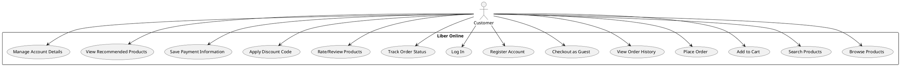
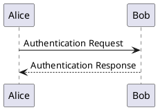
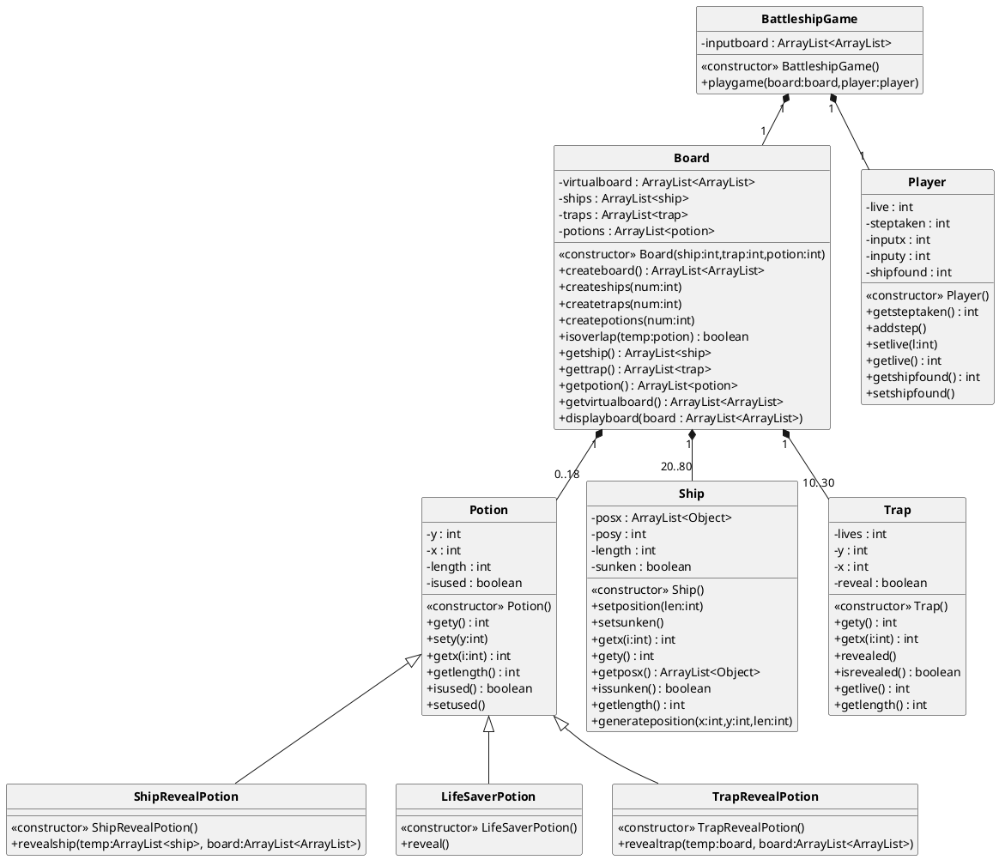
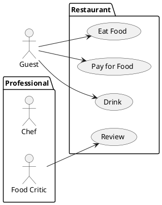
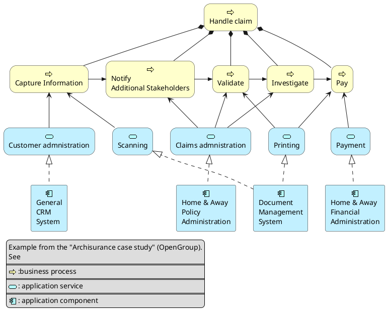
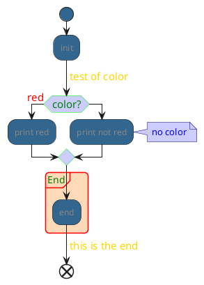
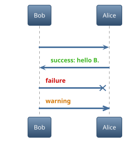

## 1. Introduction

### 1.1 Purpose
The purpose of this document is to describe the functional and non-functional requirements for the Bookstore Webshop, an online platform where users can browse, search, and purchase books.

### 1.2 Scope
The Bookstore Webshop will allow users to browse through available books, search by various criteria, and purchase books online. It will include functionality for user account management, shopping cart management, and order tracking. The platform will support both physical and digital book formats.

### 1.3 Definitions, Acronyms, and Abbreviations
- **SRS**: Software Requirements Specification
- **Webshop**: Online store for purchasing products
- **UI**: User Interface
- **DB**: Database
- **API**: Application Programming Interface

### 1.4 References
- Web Development Guidelines
- REST API Documentation
- Database Schema Design

---

## 2. Overall Description

### 2.1 Product Perspective
The Bookstore Webshop is a standalone system that will be integrated with a payment gateway and external APIs for book metadata and reviews.

### 2.2 Product Features
- User Registration and Login
- Browse and Search Books
- Shopping Cart Management
- Order Placement and Payment Processing
- Order Tracking
- Digital Book Delivery (for eBooks)
- Review and Rating System
- Admin Panel for Book Management

### 2.3 User Classes and Characteristics
- **Customers**: Can browse, search, purchase books, leave reviews.
- **Admins**: Can manage inventory, view sales reports, and handle customer queries.
- **Visitors**: Can browse books but need to register or log in to make purchases.

### 2.4 Operating Environment
- Web application accessible via modern web browsers (Chrome, Firefox, Safari).
- Supported on desktop, tablet, and mobile devices.

### 2.5 Assumptions and Dependencies
- Users have access to a stable internet connection.
- The webshop relies on third-party payment processors.
- Integration with external book databases (e.g., Google Books API).

---

## 3. Functional Requirements

### 3.1 User Registration and Authentication
- The system shall allow users to register using an email address and password.
- The system shall provide password recovery functionality.
- Users must be able to log in using their credentials.

### 3.2 Browse and Search Books
- Users shall be able to browse books by categories, such as genre, author, or popularity.
- The system shall provide a search function allowing users to find books by title, author, ISBN, or keywords.
- Users shall be able to filter search results by price, rating, and format (eBook or physical).

### 3.3 Shopping Cart
- Users shall be able to add and remove books from their shopping cart.
- The system shall display the total price of the books in the shopping cart.
- Users shall be able to proceed to checkout to purchase items in the cart.

### 3.4 Checkout and Payment
- Users shall be able to provide shipping information and choose shipping options.
- The system shall integrate with a payment gateway to process credit/debit card payments and digital wallets.
- Upon successful payment, users shall receive an order confirmation via email.

### 3.5 Order Tracking
- Users shall be able to view the status of their orders from the order history page.
- The system shall update the status of the order (e.g., shipped, delivered).

### 3.6 Digital Book Delivery (eBooks)
- Upon successful payment, users shall be able to download purchased eBooks from their account page.
- The system shall enforce download restrictions based on licensing (e.g., limit to three downloads).

### 3.7 Reviews and Ratings
- Registered users shall be able to leave a rating (1-5 stars) and review for purchased books.
- The system shall display average ratings and customer reviews on the book detail page.

### 3.8 Admin Panel
- Admins shall be able to add, edit, and remove books from the inventory.
- Admins shall be able to manage user accounts and view sales reports.
- Admins shall be able to respond to customer support queries.

---

## 4. Non-Functional Requirements

### 4.1 Performance Requirements
- The system shall load the home page within 3 seconds under normal load.
- The search function shall return results within 2 seconds for most queries.

### 4.2 Security Requirements
- User passwords shall be stored securely using hashing and encryption.
- The system shall use HTTPS for all data transmission to ensure secure communication.
- The system shall comply with GDPR regulations for handling personal data.

### 4.3 Usability Requirements
- The UI shall be intuitive and easy to navigate for users of all ages.
- The website shall be responsive and accessible on mobile devices and tablets.
- The system shall comply with accessibility standards, including keyboard navigation and screen reader compatibility.

### 4.4 Reliability Requirements
- The system shall have an uptime of 99.9%.
- The system shall perform daily backups to prevent data loss.

### 4.5 Maintainability Requirements
- The codebase shall follow best practices for modularity and reusability.
- Documentation shall be provided for all major components of the system.

### 4.6 Scalability Requirements
- The system shall be scalable to support up to 10,000 concurrent users.

---

## 5. System Architecture

### 5.1 High-Level Architecture
- **Frontend**: HTML5, CSS3, JavaScript (React or Vue.js)
- **Backend**: Node.js with Express.js (or Django/Ruby on Rails)
- **Database**: PostgreSQL (or MySQL)
- **Payment Gateway**: Stripe or PayPal API
- **Book Metadata API**: Integration with Google Books API
- **Hosting**: Cloud-based (AWS, Heroku, or Azure)

---
## 5.2 UML Diagram

## 5.3 UML ClassDiagram

## 5.4 Use Case Diagram

## 5.5 Activity Diagram

## 5.6 Activity Diagram

## 5.7 State Diagram

---

## 6. Appendices

### 6.1 Glossary
- **GDPR**: General Data Protection Regulation, a law on data protection and privacy in the EU.

### 6.2 Document Approvals
| Name         | Role          | Description | Date      |
|--------------|---------------|-----------|-----------|
| Pietje Puk  | Project Lead  | Done some stuff |2024-10-18|
| Pietje Puk  | Project Lead  | Done other stuff|2024-10-20|
| Pietje Puk  | Project Lead  | Done even more stuff|2024-10-24|

---

This SRS document provides a foundation for the development and testing of the Bookstore Webshop. Future revisions will include more detailed use cases and system architecture diagrams.
