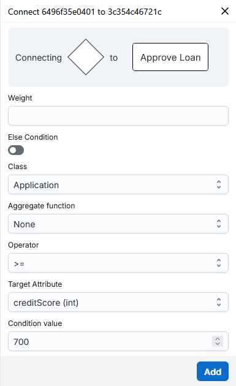

    

<h1 align="center">
  <b>Working with Diagrams</b>
</h1>

You can create diagrams from scratch in the `Projects` section accessible from the sidebar menu. Here, you first create and name your project. A project can have many systems, and a system can have many diagrams. For example, you might want to create a project called `Airline`, which is split over several systems such as `Logistics`, `Payments`, `Marketing`, `Maintenance`, etc. Each of these systems might contain one or several class, use case or activity diagrams. These diagrams may or may not have common elements, like the class `Airplane` appearing in class diagrams in both the `Logistics` and the `Maintenance` systems.

Once you have your project and system, you can get started working on a diagram.

<h2 align="center">
  <b>Class Diagrams</b>
</h2>

<h3>Nodes</h3>
<b>Creating and Editing</b>

Nodes are the buidling blocks of class diagrams. By right-clicking your modelling area, you have the option to create a new node representing a <b>Class</b>, <b>Enum</b>, <b>Signal</b> or <b>Application</b>. You will have to name your node. If you are creating an <b>Enum</b>, you can also use the create menu to specify your literals. By right clicking a node, you then have the option to edit it. This allows you to:

<ul>
  <li>rename the node</li>
  <li>edit attributes and methods for classes</li>
  <li>edit literals for enums</li>
</ul>
<b>Importing Nodes from Other Systems</b>

In the class diagram, you have the option to import nodes from other diagrams, and even from other systems within your project. The origin system is marked when it is different than the current one. Sometimes you are importing a node that in other diagrams has some preexisting edges connecting it to nodes that already exist in your current diagram. If that happens, these edges will be added to your current diagram as well.

<b>Removing and Deleting</b>

You have two options in terms of removing a node:

<ul>
  <li><b>Remove from Diagram</b>: only deletes the node and its edges in the current diagram.</li>
  <li><b>Delete Completely</b>: removes the node and its edges in any diagram in your project.</li>
</ul>

This distinction is important when you have imported a node to multiple systems, and allows you to decide whether you want to delete it only from the current diagram or from everywhere in your project.

 

<h3>Edges</h3>
<b>Creating and Editing</b>

You can create an edge by right-clicking on a source node and then selecting the <b>Connect</b> option, then selecting the target node. You can create different types of edges: <b>Association</b>, <b>Generalization</b>, <b>Composition</b>, <b>Dependency</b>. In the edge creation menu, you have the option of setting a label, as well as any eventual source/target label or multiplicity. You can right-click an edge and then select <b>Edit</b> in order to change all of these properties.

You may be in the situation of having to reposition edges in order to avoid overlaps that can make the label, multiplicityes or edge type indistinguishable. You can drag the circular endpoints to reposition the edge. You can also add bending points by double-clicking a specific spot on the edge. These points are also draggable. If you wish to delete a bending point, you can do so by right-clicking it.

<b>Removing and Deleting</b>

When removing an edge, you have similar options as for a node:

<ul>
  <li><b>Remove from Diagram</b>: only removes the edge from the current diagram.</li>
  <li><b>Delete Completely</b>: removes the edge from any diagram in your project.</li>
</ul>

Once again, this distinction is important when you have imported the same nodes to multiple systems, which can lead to imported edges that reoccur in multiple diagrams.

<h2 align="center">
  <b>Use Case Diagrams</b>
</h2>

<h3>Nodes</h3>
Similarly to the class diagram, you can right-click anywhere to have the option to <b>Create a Node</b>. You can then select between several types:
<ul>
  <li><b>Actor</b> nodes</li>
  <li><b>Use Case</b> nodes</li>
  <li>One <b>System Boundary</b> per diagram. After adding it, you have the option to add other nodes to the system by right-clicking them. This means that their position respective to the system boundary is fixed. If you move the system boundary, the added nodes will move with it. You can also remove nodes from the system in the same way.</li>
</ul>

<h3>Edges</h3>

To create an edge, right-click on a source node and select <b>Connect</b>. Then select between the following edge types: <b>Interaction</b>, <b>Extension</b>, <b>Inclusion</b>, and <b>Generalization</b>.

> ☝️ Node imports are not yet available in Use Case diagrams. Because of this, there is no distinction between deletion and removal for nodes and edges, you only have the <b>Delete</b> option.

<h2 align="center">
  <b>Activity Diagrams</b>
</h2>

Activity diagrams are a central component of AI4MDE. They describe the dynamic behavior of your system and directly influence how web application prototypes are generated. The following sections explain the main elements used to create activity diagrams.

<h3>Nodes</h3>

To create a node, right-click anywhere on the canvas and select <b>Create Node</b>. You can choose from the following types:

<ul>
  <li> <b>Swimlane</b> Swimlanes organize Action nodes according to the Actor responsible for performing them. When creating a Swimlane, you must select an Actor from the Actors defined in your Use Case diagrams. If no Actors exist yet, this list will be empty. </li>
  <li> <b>Action</b> Action nodes represent tasks performed within the workflow. When creating an Action, you must provide a name. You can also configure its <b>Execution Type</b>, which affects prototype generation:
    <ul>
      <li><b>UI Task</b>: performed manually by the user associated with the Swimlane.</li>
      <li><b>Automatic</b>: executed automatically in the background. You can define custom code for this behavior.</li>
    </ul>
  The Execution Type does not affect diagram logic, only the generated prototype.</li> 
  <li> <b>Control nodes</b> Control nodes manage the flow of execution. Available types include: <b>Initial</b>, <b>Final</b>, <b>Fork</b>, <b>Decision</b>, <b>Join</b>, and <b>Merge</b>.</li>
  <li> <b>Object</b> Object nodes represent instances of Classes defined in your Class diagrams. When creating an Object node, you must select a Class. You may optionally specify a State. If no Class diagrams or Classes exist yet, the selection list will be empty. </li>
  <li> <b>Event</b> Event nodes represent Signals defined in your Class diagrams. When creating an Event node, you must select an existing Signal. If no Signals exist yet, the list will be empty. </li>
</ul>

<h3>Edges</h3>

To create an edge, right-click a source node and select <b>Connect</b>, then choose the target node. For most edges, you can configure the <b>Guard</b> and <b>Weight</b>.

<h3>Decision Nodes and Conditional Flows</h3>

Edges originating from a <b>Decision</b> node use structured conditions instead of simple guards. These conditions determine which path is taken at runtime.

When connecting from a Decision node, you can select between two options:

<ul> <li><b>Condition</b> allows you to set a condition for the parsing of this edge based on a value of a selected attribute of a chosen Class node from your system. In the Class field, you can select one of these existing classes. If there are no Class diagrams or Class nodes in your system yet, this list will be empty. With the Aggregate Function option, you can choose whether you want to aggregate all the instances of this class that will exist in your future prototype, for example by considering the SUM, AVG, MIN, MAX, or COUNT of the values for the selected attribute. This attribute can then be set using the Target Attribute field, that shows a list of all the attributes of the selected Class node. With the Operator field, you can choose the operator used in your condition: ==, !=, <, <=, >, or >=. Some of these operators, such as <, <=, >, and >=, can only be used with numeric target attributes. Finally you can set the Condition Value field, which corresponds to the value that your experssion will be compared with, be it a string or numeric type.</li>
<li><b>Else Condition</b> means that this edge is parsed whenever none of the conditions of the other edges originating from the same Decision node are met.</li> </ul>

See this example of how to create a loan approval decision flow.

    

    

> ☝️ Node imports are not yet available in Activity diagrams. Because of this, there is no distinction between deletion and removal for nodes and edges, you only have the <b>Delete</b> option.